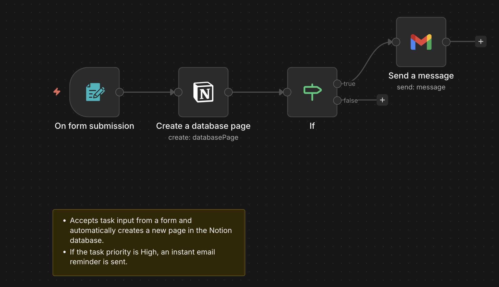
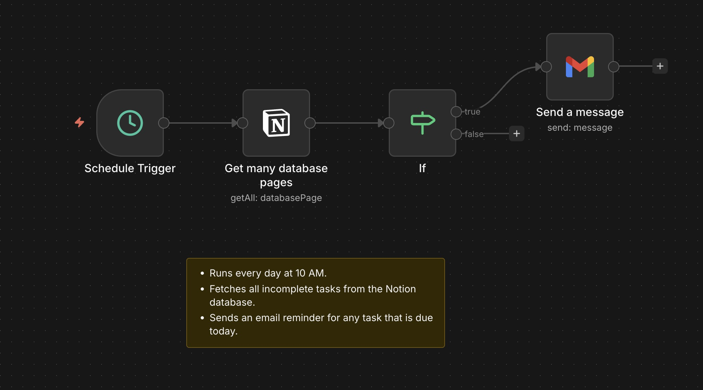
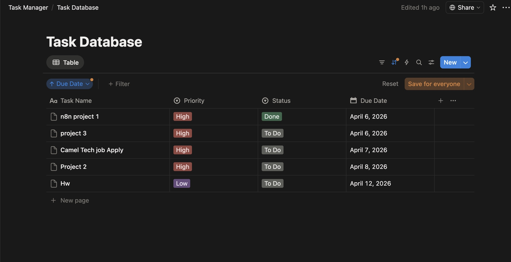
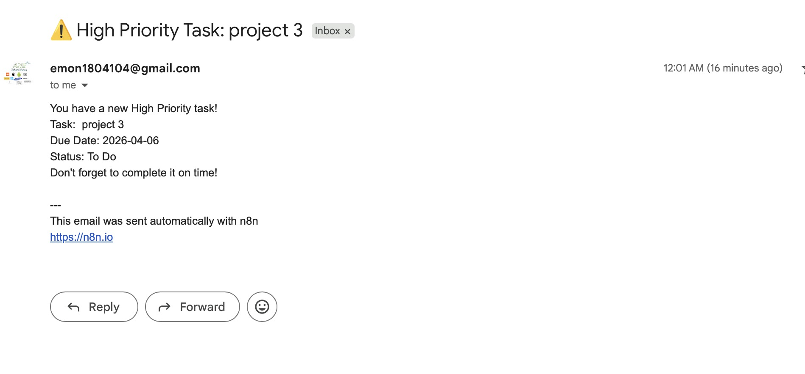
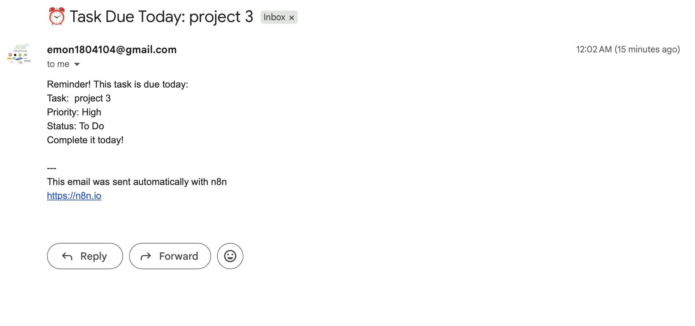

# Automated Task Manager using Notion and n8n

An automation system that manages tasks using 
Notion as a database and n8n for workflow automation.

## Demo
▶️ [Watch Demo on YouTube] https://youtu.be/sGoTqGCXkuw

## Features
- Submit tasks through a form
- Automatically stores tasks in Notion database
- Sends instant email for High Priority tasks
- Daily reminder email for tasks due today

## Tools Used
- n8n Cloud
- Notion API
- Gmail

## Workflows

### Workflow 1 — Add Task
Form → Notion Database → If High Priority → Gmail

### Workflow 2 — Daily Reminder
Every 9:30 AM → Get Notion Tasks → If Due Today → Gmail

## Screenshots

### Workflow 1 — Add Task

### Workflow 2 — Daily Reminder

### Notion Database

### Email Reminder

